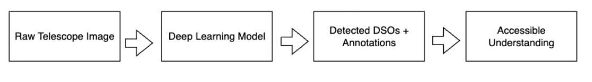
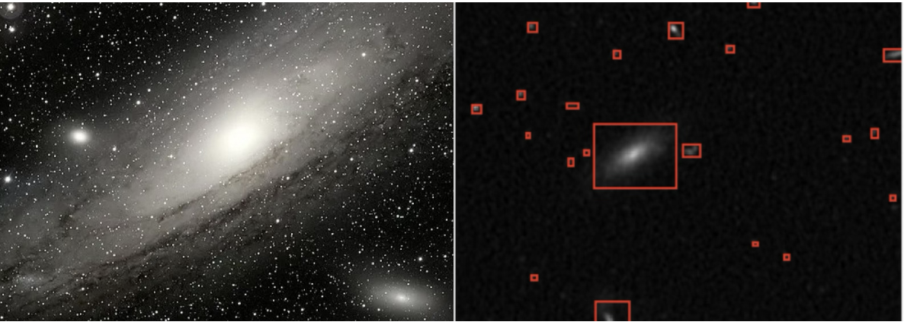
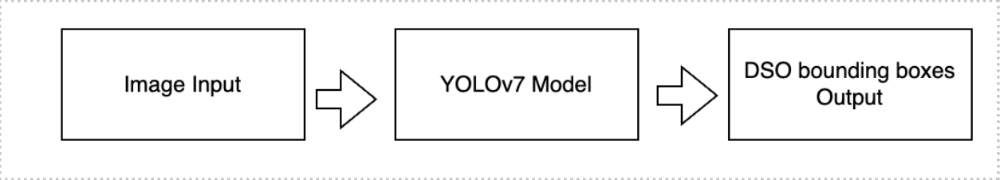
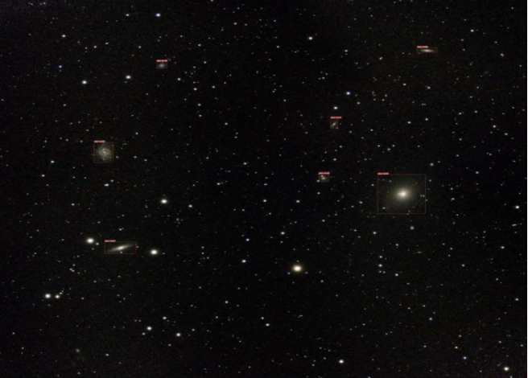
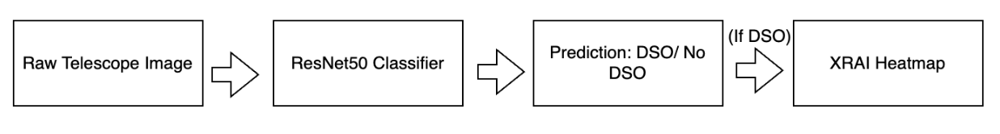
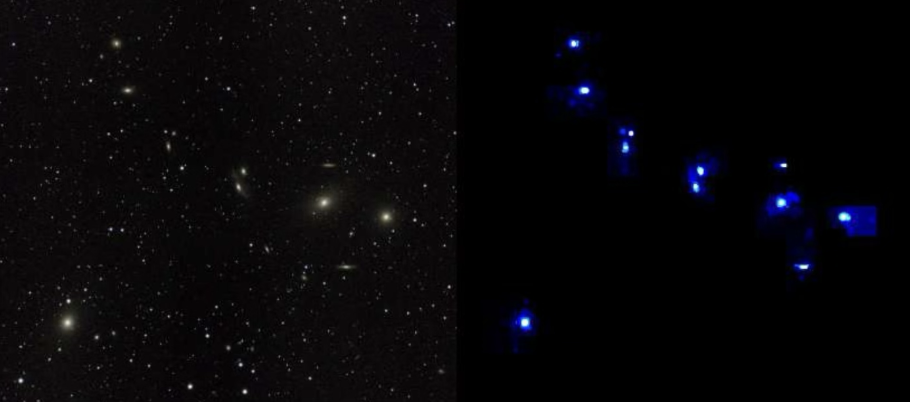
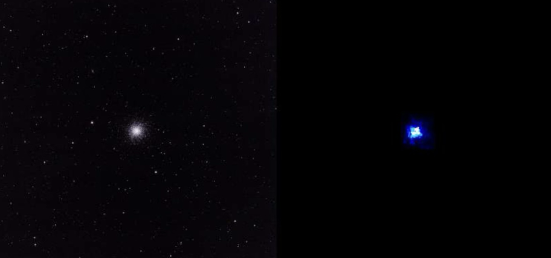
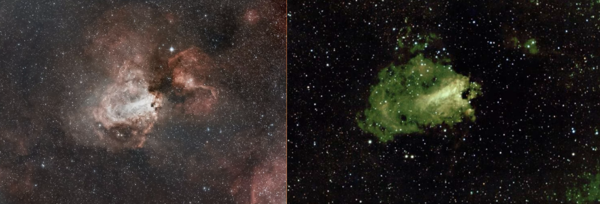

<h2>Introduction</h2>

With the growth of smart telescopes capable of Electronically Assisted Astronomy (EAA), astronomy is becoming more accessible to hobbyists and the public. Yet, detecting faint galaxies, nebulae and clusters in light-polluted skies remains a persistent challenge. The paper <b>"Deep Sky Objects Detection with Deep Learning for Electronically Assisted Astronomy"</b> by Parisot & Jaziri tackles this head-on—crafting deep learning (DL) solutions that help in real-time detection of celestial wonders. In this blog, we discover and explore a range of deep learning techniques developed for detecting Deep Sky Objects (DSOs) in images captured by smart telescopes and provide a glimpse into how each technique works and reflect on their possible real-world applications. 

<h2>Background: From Eyepieces to Algorithms </h2>

Stargazing has long been a pursuit of patience and perseverance. Historically, even viewing well-known deep sky objects like the Andromeda Galaxy or Orion Nebula demanded clear skies, remote locations and hours of manual setup. Observers had to contend with cold nights, light pollution and complex equipment—mounts, eyepieces, filters and tracking systems—all of which required expertise to operate. 

Enter Electronically Assisted Astronomy (EAA), this modern approach revolutionized astronomy by replacing the eyepiece with a digital sensor. EAA-enabled smart telescopes like Stellina and Vespera allow users to capture and stack images of nebulae and galaxies in real-time, even from urban settings. 

But despite this leap forward, a new problem emerged while smart telescopes produce stunning images, they do not tell you what you are looking at. For the untrained eye, a faint blur might be a galaxy or just noise. The task of identifying Deep Sky Objects (DSOs) within captured frames still requires astronomical knowledge or manual cross-referencing with star charts.

<h2>Current Limitations in Electronically Assisted Astronomy </h2>

Despite making stargazing more accessible and visually engaging, EAA still faces key challenges—especially in automated Deep Sky Object (DSO) identification: 
<ol>
<li><b>Image Ambiguity</b>  Faint DSOs often blend into the background, particularly under light-polluted or moonlit skies, making them hard to distinguish from stars or noise.</li> 
<li><b> No Real-Time Feedback</b>  Most smart telescopes do not confirm if the target was captured, requiring manual checks or post-processing, which reduces interactivity and may lead to missed objects.</li>
<li><b>Environmental Sensitivity</b> Weather, light pollution and seasonal factors heavily influence image quality. Without real-time detection, users may unknowingly capture unusable data.</li>
<li><b>Lack of Object Annotation</b> Consumer telescopes rarely label or identify captured objects, limiting scientific value and user understanding </li></ol>
    

These issues underscore the need for intelligent, real-time DSO detection and annotation using deep learning to improve efficiency and user experience. 

<h2>High-Level Implementation of Deep Learning in DSO Detection </h2>

This diagram outlines the conceptual flow of how deep learning turns raw telescope imagery into actionable insights, accessible even to non-experts.

**Step 1: Raw Telescope Image** 

Smart telescopes capture long-exposure, stacked images of the night sky. These frames may include stars, galaxies, nebulae and noise due to light pollution or atmospheric interference. 

*   Format: Typically, in RGB or FITS format 
    
*   Challenge: DSOs are often faint and indistinct; stars dominate the frame 
    

 **Step 2: Deep Learning Model** 

A trained deep learning model such as a YOLO detector, ResNet classifier, or GAN generator, analyzes the image to identify whether any Deep Sky Objects are present and where they are located. 

_**Internally, this involves:**_ 

*   **Feature extraction**: Learning to differentiate patterns like spiral arms, diffuse nebula glow or galaxy cores 
    
*   **Localization**: Drawing bounding boxes or creating heatmaps around DSOs 
    
*   **Classification**: Labeling the type of object (e.g., "galaxy", "nebula", etc.) 
    

**Step 3: Detected DSOs + Annotations** 

The output is an annotated image: 

*   Bounding boxes around recognized objects 
    
*   Labels for known catalog entries (e.g., “M31 – Andromeda Galaxy”) 
    
*   Heatmaps highlighting high-confidence regions 
    

This makes it immediately clear what the image contains. 

 **Step 4: Accessible Understanding** 

Now, you can easily understand 

*   **What objects they captured** 
    
*   **Where those objects are in the frame** 
    
*   **Why the model made those predictions** (if using XAI tools like XRAI) 
    

This bridges the gap between data and understanding, helping the user understand data. 

<h2>Data Collection: Ground Truth from the Backyard Sky </h2>

 The training data used in this study was captured using consumer-grade smart telescopes—specifically the Stellina and Vespera in real-world conditions across Luxembourg, France and Belgium. Over 50,000 raw FITS images and nearly 5,000 post-processed JPEG images were gathered during these sessions, often under light-polluted skies and variable weather. This dataset, featuring more than 250 different targets visible from the Northern Hemisphere.

| **Dataset**            | **Content**                                         | **Used For**                                                 |
|------------------------|-----------------------------------------------------|---------------------------------------------------------------|
| **Raw FITS Dataset**   | • Stored as high-resolution raw telescope output    | • Technique 1 (Star removal) + Evaluation                     |
| **DeepSpaceYOLO Dataset** | • 4696 JPEG images, 608x608 resolution          | • Techniques 2 (YOLO), 3 (ResNet), Pix2Pix GAN                |

<h2>Diving into the Detection Techniques </h2>

 Now that we have established the motivation and the data behind this research, we will dive into the four key deep learning techniques implemented to tackle the challenge of Deep Sky Object detection. Each approach brings a unique blend of speed, accuracy and interpretability. These include: 

*    A **naive approach** using StarNet with basic computer vision 
    
*    A **custom-trained YOLOv7** object detection model 
    
*    A **ResNet50 classifier combined with XRAI** for explainable detection 
    
*    A **Pix2Pix GAN model** that mimics attention maps for rapid visual feedback 
    

<h2>Technique 1: Naive Detection Using StarNet + Computer Vision</h2>

**Overview** 

 The first method tested is simple yet creative approach: remove distracting stars from the image using a tool called StarNet and then apply classic computer vision (CV) techniques. The idea here was to strip out the stars first and then isolate what might be celestial objects of interest. 

**How It Works – Step by Step** 
<ol>
<li> <b>Apply StarNet</b> </li>
    
StarNet is a pre-trained deep learning model designed to remove stars from astronomical images. It outputs an image with only the background content typically nebulae, galaxies or clusters. 

<li><b>Convert to Grayscale</b></li>
    

The star-removed image is simplified to a grayscale version, making it easier to detect edges and contours. 

<li><b>Edge Detection with Canny Filter</b> </li>
    

A standard CV technique (Canny edge detection) is used to find the boundaries of objects. 

<li><b>Bounding Box Calculation</b></li>
    

Any distinct non-stellar feature identified in the image is boxed using OpenCV functions. 

<li><b>Overlay Results</b></li>
    

These bounding boxes are then drawn back onto the original image, highlighting where DSOs were found. 
</ol>

**Results:** 

 StarNet removes stars (left), and classic CV methods detect potential DSOs (right). Red boxes mark regions identified as non-stellar features using edge detection and OpenCV 

**Limitations** 

*   **Noise-sensitive**: Residual halos from large stars or bright areas often confuse the edge detector. 
    
*   **Faint DSOs missed**: Subtle objects may be lost during the star removal or go undetected entirely. 
    
*   **False positives**: Star artifacts or noise blobs may be wrongly flagged as galaxies or nebulae. 
    

Despite being fast and requiring no training data, this technique has limited precision and recall, making it unsuitable for more nuanced or research applications. 

**When Is It Useful?** 

 This method may be helpful for quick demos or rough filtering, especially if computational resources are limited. However, it lacks the robustness and interpretability needed for broader use making it a good baseline to compare against smarter models. 

<h2>Technique 2: Object Detection with a Custom YOLOv7 Model </h2>

**Overview** 

 "YOLO" stands for You Only Look Once, a deep learning architecture designed for real-time object detection. YOLO models scan an image in one pass, identifying both the presence and position of objects with bounding boxes. It is fast, accurate and well suited to applications where both speed and spatial awareness matter like identifying galaxies and nebulae in telescope images. 

**How It Was Implemented** 

The YOLOv7 pipeline takes a telescope image as input and outputs bounding boxes identifying Deep Sky Objects (DSOs) in real time. 

<ol>
<li><b>Dataset Creation** – DeepSpaceYoloDataset</b></li>
    

 The authors compiled a dataset of 4,696 annotated images, drawn from real telescope sessions using Vespera and Stellina instruments. Each image had to be manually labelled and bounding boxes had to be drawn around DSOs.

<li><b>Transfer Learning for YOLOv7</b></li>
    

Instead of training from scratch, the model was built using transfer learning starting from a pre-trained YOLOv7 model and fine-tuning it on the custom dataset. This significantly reduced training time while improving convergence and performance on astronomy-specific features. 

<li><b>Training Parameters</b></li>
    
<ul><li>Batch size: 4 </li>
    
<li>Image size: 608×608 pixels </li>

<li>Epochs: 200 </li>
    
<li>Optimizer: Adam </li>
    
<li> Framework: PyTorch with YOLOv7 official implementation </li></ul>
    
</ol>
**Performance** 

| Metric     | Value  |
|------------|--------|
| Precision  | 0.79   |
| Recall     | 0.51   |
| F1-Score   | ~0.62  |
    

This was the best-performing model among all approaches tested, delivering clean bounding boxes around DSOs  even in moderately noisy, light-polluted images. 

**Result:**  

 A wide-field image of Messier 49 (a galaxy in the Virgo cluster) showed clear, annotated boxes over the primary target and surrounding galaxies—visible even to non-expert viewers.

**Strengths** 

*   **Fast Inference**: Real-time performance during stargazing sessions. 
    
*   **Reliable on Common Targets**: Particularly accurate with bright galaxies, nebulae and clusters from catalogs like Messier or NGC. 
    
*   **Scalable**: Can be retrained for other sky regions or telescope types. 
    

**Limitations** 

*   **Small DSOs Still Challenging**: YOLO models may miss extremely faint or small objects with just a few pixels of apparent size. 
    
*   **Training Dataset Required**: This approach needs well-annotated images for training and its one of the factors affecting its F1 score. 
    

<h2>Technique 3: DSO Classification with ResNet50 and Explainable AI (XRAI) </h2>

**Overview**

 While YOLOv7 excels at spotting DSOs, it acts like a “black box” you get bounding boxes, but no insight into how the model arrived at that result. This is where Explainable AI (XAI) comes in. In this technique, a deep learning classifier detects whether a DSO is present in an image, and then XRAI (a post-hoc explainability tool) generates a heatmap showing which parts of the image contributed most to that decision. 

**How It Works** 

This pipeline classifies telescope images using ResNet50 and, if a DSO is detected, provides an interpretable explanation for accessible understanding.

1.  **Binary Classification with ResNet50** 
    
    
Images are first fed into a <b>ResNet50</b> model—a powerful convolutional neural network that learns to answer a simple question: Is a DSO present in this image?  The dataset used here was balanced between images with and without DSOs, with careful labeling to avoid bias. 

2.  **Explainability with XRAI** 
    

    
 Once the model classifies an image as “DSO present,” <b>XRAI</b>(a technique based on Integrated Gradients) kicks in to highlight where in the image the most influential features are. These show up as a <b>heatmap overlay</b>, revealing the “attention zones” the model focused on. 

3.  **Integrated Gradients as a Foundation** 
    

    
 XRAI builds on a technique called Integrated Gradients, which estimates how much each pixel contributes to the model’s final output. It does this by comparing the real image to a “baseline” (typically a black image representing sky background) and measuring how predictions change as the image morphs from the baseline to the real input. 

4.  **Region Segmentation** 
    
    
 Instead of analyzing pixels individually, XRAI groups pixels into superpixels coherent regions of the image—like the bright core of a galaxy or the wispy edges of a nebula. 

5.  **Attribution Scoring** 
    

    It then assigns importance scores to these regions based on how much they changed the model's confidence during the integration process. 

6.  **Heatmap Generation** 
    

    
 The regions with the highest cumulative contribution are overlaid as heatmaps, allowing you to visualize where the model “looked” when it decided that a DSO was present. 

So, when you see a bright blue blob on an XRAI map, you are essentially seeing where the model focused its attention the most influential pixels in the decision-making process. 

**Performance** 

*   **Accuracy** (classification): ~97% on validation set 
    
*   **Precision/Recall** (via heatmap bounding boxes): 
    
*   **Precision:** ~0.68 
    
*   **Recall:** ~0.41 
    
*   **F1-Score:** ~0.51 
    

While slightly less precise than YOLOv7, it provides something YOLO cannot: visual explainability. 

**Limitations** 

*   **Not Real-Time**: XRAI computation is slower than YOLO’s direct detection. 
    
*   **Needs More Power**: Running heatmaps on large images (like 3584×3584 px) requires dividing them into patches and stitching results. 
    
*   **No Labels or Bounding Boxes by Default**: You get _where_, but not what—without further classification layers. 
    

**Best Use Cases** 

*   **Research and outreach**: Great for explaining how AI “thinks” about astronomical images. 
    
*   **Model development**: Identifying failure points and refining detection strategies.

  **Results** 

  

 The core of Messier 13 (globular cluster)

    

 The faint glow of Messier 76 (Little Dumbbell Nebula)

    

<h2>Technique 4: Fast DSO Highlighting with Pix2Pix GAN </h2>

**Overview** 

 The third technique (ResNet50 + XRAI) gave us incredibly useful heatmaps showing which regions of the image contained Deep Sky Objects. But there is a catch: XRAI is slow, especially on large and high-resolution images. It becomes a problem when you want to provide real-time feedback. 

To overcome this, the authors turned to Generative Adversarial Networks (GANs) specifically, the Pix2Pix architecture—to generate similar highlight maps much faster. 

**How It Works** 

 Pix2Pix is a conditional GAN trained for image-to-image translation. Instead of classifying or detecting objects directly, it learns to transform one image into another in this case, from raw telescope images to heatmaps that mimic XRAI outputs. 

**Inside the GAN: Generator vs. Discriminator** 

A Generative Adversarial Network (GAN) is made of two neural networks that play a kind of game against each other: 

**1\. The Generator: "The Artist"** 

 The Generator is like an artist trained to take an input image (in our case, a telescope photo) and generate a new image (the predicted DSO heatmap). Its goal is to make the heatmap look as realistic and informative as possible—ideally, so convincing that it’s indistinguishable from one made by the more detailed, but slower XRAI technique. 

*   **Input**: RGB astronomical image 
    
*   **Output**: Synthetic heatmap showing where the DSO is likely located 
    
*   **Goal**: Fool the Discriminator into thinking its output is “real” 
    

**2\. The Discriminator: "The Critic"** 

The Discriminator is a binary classifier trained to distinguish real vs. fake heatmaps. It sees pairs of: 

*   A telescope image + a real XRAI heatmap (from training data) → should label this as “real” 
    
*   A telescope image + a generated heatmap (from the Generator) → should label this as “fake” 
    

Its job is to critique the Generator and call out any inaccuracies or oddities in the fake heatmaps. 

*   **Input**: A pair (image + heatmap) 
    
*   **Output**: Real (1) or Fake (0) 
    
*   **Goal**: Never get fooled 
    

**The Training Loop: A Learning Tug-of-War** 

*   The Generator learns from the Discriminator's feedback and gets better at faking it. 
    
*   The Discriminator sees better and better fakes and gets smarter at spotting them. 
    
*   This back-and-forth continues until the Generator becomes so good that its output becomes nearly indistinguishable from the real thing. 
    

 For example, an image of Messier 17 (Omega Nebula) processed with Pix2Pix produced a vivid highlight of the emission zone, closely mirroring what XRAI would have shown—but in a fraction of the time. 

**Strengths** 

*   **Rapid feedback**: Ideal for live demos or automated observation sessions. 
    
*   **Low compute requirements**: Great for laptops, Raspberry Pi, or embedded telescope software. 
    
*   **User engagement**: Gives users immediate visual cues about where to look. 
    

**Limitations** 

*   **Slightly less precise**: Not as analytically accurate as true XRAI, especially under noisy or low-contrast conditions. 
    
*   **No object labeling**: It shows _where_ the DSO is, but not _what_ it is.

**Results**
  
    

<h2>Summary </h2>

Each deep learning technique explored in this study brings distinct strengths tailored to different use cases in Electronically Assisted Astronomy. The <b>StarNet + CV</b> approach offers a quick and simple baseline but struggles with accuracy and noise. <b>YOLOv7</b> stands out as the most robust and balanced model, delivering high precision and real-time detection making it ideal for both automation and outreach. <b>ResNet50 + XRAI</b> trades speed for deep interpretability, offering rich visual insights into model reasoning, which is especially valuable for educational and scientific transparency. Finally, the <b>Pix2Pix GAN</b> cleverly mimics XRAI's outputs at a fraction of the cost, providing fast visual feedback for user-friendly applications. Together, these models represent a powerful toolkit, capable of transforming smart telescopes from passive imaging devices into intelligent, interactive observatories.

| Aspect         | YOLOv7                                | ResNet + XRAI                         | Pix2Pix GAN                          |
|---------------|--------------------------------------|---------------------------------------|--------------------------------------|
| Goal          | Detect and localize DSO with bounding boxes | Classify presence of DSO + explain via XAI | Generate heatmap-like visual explanation |
| Output        | Bounding boxes around DSOs            | Binary class + XRAI heatmap           | Annotated image (XRAI-style overlay) |
| Architecture  | One-stage object detector             | Deep CNN + Post-hoc XAI               | Conditional GAN (U-Net + PatchGAN)   |
| Speed         | Fast (real-time capable)              | Slow (XRAI is slow)                   | Fast (single pass, much faster than XRAI) |
| Explainability| No (black-box)                        | Yes (XRAI)                            | Approximate (visually similar to XRAI) |
| F1 Score      | 0.62 (Best)                           | 0.51                                  | Not directly comparable (PSNR >38)   |

<h2>Applications of Deep Learning in EAA </h2>

Deep learning is not just an add-on to EAA—it is a force multiplier that unlocks new levels of autonomy, scalability, and accessibility. Here are some impactful ways DL enhances the practice of astronomy: 

**1\. Smart Object Detection** 

DL models like <b>YOLOv7</b> and <b>ResNet50</b> empower smart telescopes to automatically detect Deep Sky Objects (DSOs) as images are being captured. This is especially powerful for: unattended telescopes and dynamic observation workflows, where telescopes adjust exposure times or switch targets based on detection confidence 

**2\. Post-Capture Image Filtering and Annotation** 

With thousands of images generated during observation sessions, manually reviewing them is impractical. DL-based filtering: 

*   Tags or discards low-quality frames, saving time and storage 
    
*   Identifies unexpected targets such as comets, supernovae or satellite trails 
    
*   Supports collaborative image stacking, ensuring that only high-signal frames are merged for final processing 
    

**3\. Explainability with XAI (XRAI)** 

Deep learning models are often criticized as "black boxes," but Explainable AI tools like XRAI change that narrative. By showing why a model detected a certain region as containing a DSO, these visualizations help in building user trust and educate beginners understand astronomy 

<h2>Limitations of Deep Learning in EAA</h2>

While deep learning brings significant advancements to smart astronomy, it's not without constraints. Understanding these limitations is crucial for deploying models effectively and improving them further.
 

**1\. Dataset Scope & Generalization** 

The models developed in this research were trained on data captured using specific smart telescopes (e.g., Stellina and Vespera with 50–80 mm apertures). As a result: 

*   Generalizing to different telescope setups—with other apertures, sensors, or focal lengths—may require collecting new data and retraining. 
    
*   Performance may drop if applied to instruments with vastly different optics, such as DSLR-based rigs or professional observatories. 
    

**2\. Computational Constraints** 

Advanced explainability methods like XRAI, while powerful, are computationally intensive, particularly on large, high-resolution astronomical images 

*   Real-time applications may require breaking images into smaller patches, which adds complexity. 
    
*   Devices without GPUs (e.g., embedded systems or Raspberry Pi) may struggle unless optimized or paired with lighter models like Pix2Pix. 
    

**3\. Detection Challenges & Ambiguities** 

Despite strong results, certain astronomical features remain hard to distinguish: 

*   Bright stars with large halos can be misclassified as compact galaxies. 
    
*   Faint DSOs with very low contrast are often missed by object detectors. 
    
*   In borderline cases, human expert validation still outperforms AI, especially when differentiating nuanced structures. 
    

**4\. Lack of Benchmarking Standards** 

There is currently no universally accepted benchmark for evaluating deep learning models on smart telescope data which makes it hard to compare methods across research groups. Performance metrics can vary significantly based on dataset quality, preprocessing choices, and evaluation criteria. 

<h2>Future Work</h2>

While the current techniques show promise, there is ample room for improvement. Future efforts can focus on both refining existing models and expanding their capabilities to meet the demands of more diverse use cases. 

**Improving Technique 3: ResNet50 + XRAI** 

To enhance both classification accuracy and interpretability, several upgrades are envisioned: 

*   **Model Fine-Tuning:**  Adjusting parameters such as learning rate, batch size, and optimizer settings can optimize training convergence and accuracy. 

*   **Architectural Enhancements:** Exploring deeper or more efficient networks like ResNet101 or EfficientNet may improve feature extraction, especially for subtle or diffuse DSOs. 

*   **Dataset Refinement:** Removing mislabeled or low-quality samples and ensuring class balance will increase training signal clarity and reduce false positives. 

*   **Advanced Explainability Tools:** Incorporating attention-based XAI methods like Grad-CAM++ could offer sharper, more localized heatmaps, further improving model transparency and DSO pinpointing. 

**Improving Technique 2: YOLOv7 Object Detection** 

For real-time object detection, the next steps include: 

*   **Multi-Class Training:** Rather than treating all DSOs as a single class, future models can distinguish between galaxies, clusters, and nebulae, offering richer annotations and educational value. 

*   **Data Augmentation:** Introducing variations (e.g., blurring, noise injection, brightness shifts) during training can help models generalize better—especially in noisy or underexposed conditions common in urban or short-exposure setups. By advancing both classification and detection pathways, future systems will not only be faster and more accurate but also more informative, interpretable, and resilient across diverse sky-watching scenarios.

<h2>Conclusion </h2>

Deep learning is transforming Electronically Assisted Astronomy (EAA) from a passive imaging experience into an intelligent, interactive process. This work shows that even consumer-grade telescopes, when paired with models like YOLOv7, ResNet50 + XRAI, and Pix2Pix GAN can detect, highlight and explain Deep Sky Objects in real-time or near-real-time. 

Each technique brings unique value—YOLOv7 leads in detection performance, ResNet50 adds interpretability and Pix2Pix offers speed for immediate user feedback. Together, they form a diverse toolkit for smart stargazing. 

With improvements in model generalization, dataset diversity and computational efficiency, the path forward is clear: deep learning will not only help us look at the stars, but truly understand them. 

<h2>References for Blog on Deep Sky Object Detection in EAA</h2>

**Research Papers & Articles** 

1.  **Parisot, O. & Jaziri, M. (2024).** _Deep Sky Objects Detection with Deep Learning for Electronically Assisted Astronomy._ _Astronomy, 3(2),_ 122–138.  DOI: 10.3390/astronomy3020009  [Link to paper](https://www.mdpi.com/2674-0346/3/2/9) 
    
2.  **Ramos, L. T. & Rivas‑Echeverría, F. (2025).** _Deep sky object detection in astronomical imagery using YOLO models: a comparative assessment._  _Neural Computing and Applications._  DOI: 10.1007/s00521-025-11223-4  [Link to paper](https://link.springer.com/article/10.1007/s00521-025-11223-4) 
    
3.  **Baron, D. (2019).**  _Machine Learning in Astronomy: a practical overview._  arXiv: [1904.07248](https://arxiv.org/abs/1904.07248)  [Link to paper](https://arxiv.org/abs/1904.07248) 
    

**Datasets & Code Resources** 

*   **DeepSpaceYoloDataset** – ~4,696 annotated RGB images captured by smart telescopes.  [Access Dataset](https://www.mdpi.com/2306-5729/9/1/12) 
    
*   **Augmented‑DeepSpaceYolo** – Expanded to ~8,421 images with realistic augmentations for model robustness.  [GitHub Repository](https://github.com/Leo-Thomas/Augmented-DeepSpaceYolo) 
    

**Related Context** 

*   **Astroinformatics Overview**  Intro to data science and AI in astronomy.  Wikipedia: [Astroinformatics](https://en.wikipedia.org/wiki/Astroinformatics) 
    
*   **YOLO Object Detection in Astronomy**  Foundational approach for real-time object detection applied to sky imagery.  A&A YOLO Study  [Original YOLO Paper (arXiv)](https://arxiv.org/abs/1506.02640)
